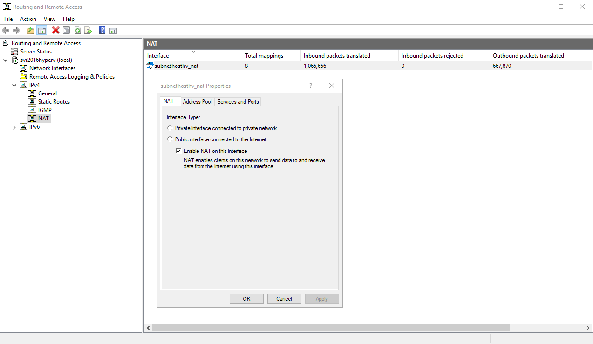

# Make a VM Host Hyper-V Nested A VMs inside to Simulate Infra Structure and test Azure Migrate. 

## Nested Virtualization in Azure

We announced nested virtualization support coming to Azure with Dv3 or Ev3 series at //build [session](https://channel9.msdn.com/Events/Build/2017/B8087) last month.
More Information and Capture are much betters Words:


Today we are excited to announce that you can now enable nested virtualization using the [Dv3 and Ev3 VM sizes](https://aka.ms/introdande). We will continue to expand support to more VM sizes in the coming months.

For software and hardware prerequisites, configuration steps and limitations for nested virtualization please see the [document here](https://docs.microsoft.com/en-us/virtualization/hyper-v-on-windows/user-guide/nested-virtualization). In this blog we will discuss a couple interesting use cases and provide a short video demo for enabling a nested VM.

Now not only you can create a Hyper-V container with Docker ([see instructions here](https://docs.microsoft.com/en-us/virtualization/windowscontainers/manage-containers/hyperv-container)), but also by running nested virtualization, you can create a VM inside a VM. Such nested environment provides great flexibility in supporting your needs in various areas such as development, testing, customer training, demo, etc. For example, suppose you have a testing team using Hyper-V hosts on-prem today. They can now easily move their workloads to Azure by using nested VMs as virtualized test machines. The nested VM hosts will be used to replace physical Hyper-V hosts, individual testing engineer will have full control over the Hyper-V functionality on their own assigned VM Host in Azure.

Let’s look at another example, suppose you want to run your development code, tests or applications on a machine with multiple users on it without impacting them, you can use the nested virtualization technology to spin up independent environments on demand to do that. Within nested VMs, even if you are running a chaos environment your users will not be impacted.

*** How to enable Internet and vNET connectivity for nested VMs in Azure ***

http://www.virtualbox.org/manual/ch06.html
https://pubs.vmware.com/workstation-11/index.jsp?topic=%2Fcom.vmware.ws.using.doc%2FGUID-D9B0A52D-38A2-45D7-A9EB-987ACE77F93C.html

**NAT** - Your host will act as a router (firewall) and your guests will be on a private subnet. Use this if you are not running servers on the guests.

**Bridged** - Your guests will get a ip address on the same subnet as your host. Use this if you are running servers on the guest and wish to connect from other computers on the LAN.

**Host Only** - Sort of a hybrid. As the name implies, with this option you can connect to the guest servers from the host only. Use this for "private" (host only) servers. I use this if I am running a test web server.

Hyper-V nested virtualization in Azure has unlocked different scenarios and use cases such as sandbox environments, running unsupported operating systems or legacy applications that require specific features that are not natively supported in Azure, think about that application that has licenses tied to a MAC address for example.

In certain scenarios, you want those nested VMs to connect to the Internet or other VMs in Azure, however, due to restrictions on the network fabric, it is not possible to create an external switch and give VMs direct access to the host’s physical network. A solution to this is to configure NAT so that VMs can access the Internet with the host NATed public IP and also routing to enable connectivity to other VMs in Azure. In this blog post, I will walk you through the process of configuring nested VMs networking to achieve those goals.

## **Build the virtual network**

We will need to build a vNet with two subnets, one for the host LAN traffic which may include other Azure VMs as well and another one for Internet traffic where we will enable NAT.

Ours Networks segments:

**rg-migrationsource-lab-vnet** – 10.2.**0**.0/20  (Main address space)
**subnethosthv (NAT Subnet)** – 10.2.**0**.0/24
**AzureBastionSubnet**  – 10.2.**1**.0/27
**subnethostlan (LAN Subnet)** – 10.2.**2**.0/24


Later on, we will use 10.2.**3**.0/24 virtual address space for the nested VMs running inside the Hyper-V host.

## **Build the Hyper-V Host VM**  (Standard D16s v3 (16 vcpus, 64 GiB memory)

- Create a new Azure VM that will be your Hyper-V host. Make sure you pick a size that [supports nested virtualization](https://azure.microsoft.com/en-us/blog/nested-virtualization-in-azure/) and connect the first network adapter to the **NAT subnet** as you build the VM. It is important that the first adapter is connected to the NAT subnet because by default all outbound traffic is sent through the [primary network interface](https://docs.microsoft.com/en-us/azure/virtual-network/virtual-network-network-interface-vm).
- Once the VM is provisioned, [add a secondary network adapter](https://docs.microsoft.com/en-us/azure/virtual-network/virtual-network-network-interface-vm#vm-add-nic) and connect it to the **LAN subnet**

- [Enable IP forwarding](https://docs.microsoft.com/en-us/azure/virtual-network/virtual-network-network-interface#enable-or-disable-ip-forwarding) on the newly created secondary interface

## **Configure the Hyper-V Host**

Install the necessary roles for the next steps:

- Hyper-V
- DHCP
- Routing (RRAS)

DHCP will be used to automatically assign IP addresses to the nested VMs and RRAS will be used to route traffic between the nested VMs and other Azure VMs as well as provide NAT for Internet access.

```powershell
Install-WindowsFeature -Name Hyper-V,DHCP,Routing -IncludeManagementTools -Restart
```

Create a virtual switch that will be used by the nested VMs as a bridge for NAT and Routing

```powershell
New-VMSwitch -Name "Nested" -SwitchType Internal
New-NetIPAddress –IPAddress 10.2.2.1 -PrefixLength 24 -InterfaceAlias "vEthernet (Nested)"
```

Rename the network adapter names on the Hyper-V host to match the subnet names in Azure, this will make it easier to identify the networks when we are configuring routing. In this example, this is what the host network settings look like after creating the switch.


## **Configure DHCP**

Create a DHCP scope that will be used to automatically assign IP to the nested VMs. Make sure you use a valid DNS server so the VMs can connect to the internet. In this example, we are using 8.8.8.8 which is Google’s public DNS.

```powershell
Add-DhcpServerV4Scope -Name "Nested" -StartRange 10.2.2.2 `
				    -EndRange 10.2.2.254 -SubnetMask 255.255.255.0
Set-DhcpServerV4OptionValue -DnsServer 8.8.8.8 -Router 10.2.2.1
```

## **Configure RRAS**

First, we will enable NAT for Internet access. Open the **Routing and Remoting Access console**, use custom configuration, select **NAT** and **Routing**, once the service is started, navigate to **IPV4** , right-click **NAT** and select **New Interface.** Now select the interface that matches your NAT subnet and enable NAT as follows:




We will now configure static rules to routes to allow traffic from nested VMs to other VMs connected to the Azure virtual network.

Under **IPv4**, right-click **static routes**, select **new static route** and create routes as follows:


This route is to allow the primary interface to respond to traffic destined to it out of its own interface. This is needed to avoid an asymmetric route.

Create a second route to route traffic destined to the Azure vNet. In this case, we are using 10.0.0.0/16 which encompasses our labvnet including the Hyper-V LAN subnet.


At this point, our host is ready to automatically assign IPs to the nested VMs, it can now also allow VMs to connect to the Internet with RRAS NATing the traffic.

## **Configure User-Defined Routes**

The last step in the process is to configure UDRs in Azure to enable traffic to flow back and forth between VMs connected to the Azure vNet and nested VM’s in our Hyper-V host. We do so by telling Azure to send all traffic destined to our nested VMs, **10.2.2.0/24** in this example, to the LAN IP of our Hyper-V host where RRAS will route the traffic to the VMs via the internal switch created earlier.

```
# Vm Must to be Desallocated so stopped. 

$rg = 'rg-migrationsource-lab'
$vmname = 'svr2016hyperv'
$vNetName = 'rg-migrationsource-lab-vnet'
$SubnetLan = 'subnethostlan'
$location = 'canadacentral'

#Create Route Table
$routeTableNested = New-AzRouteTable `
  -Name 'nestedroutetable' `
  -ResourceGroupName $rg `
  -location $location
 
#Create route with nested VMs destination and Hyper-V host LAN IP as a next-hop
$routeTableNested  | Add-AzRouteConfig `
  -Name "nestedvm-route" `
  -AddressPrefix 10.2.3.0/24 `
  -NextHopType "VirtualAppliance" `
  -NextHopIpAddress 10.2.2.4 `
 | Set-AzRouteTable
 
#Associate the route table to the LAN subnet
 Get-AzVirtualNetwork -Name $vNetName | Set-AzVirtualNetworkSubnetConfig `
 -Name $SubnetLan `
 -AddressPrefix 10.2.2.0/24 `
 -RouteTable $routeTableNested | `
Set-AzVirtualNetwork
```

After creating an additional Azure VM which we want to use to test connectivity from outside the host, our final network topology is this:


 

## Conclusion

We now have full connectivity to both the Internet and other VMs connected to the Azure vNet allowing the nested VMs to be reachable by other devices outside the Hyper-V host.


All VMs Ping 1.1.1.1 either HOST that VMs Nested. !!

https://docs.microsoft.com/en-us/azure/migrate/hyper-v-migration-architecture#performance-and-scaling
https://stackoverflow.com/questions/51179826/azcopy-upload-maxes-out-connection


**The following are some of the use cases for nested virtualization**

**Isolated environments**. You can create nested virtual machines that are connected with each other via an isolated virtual network. Thus, you can create a fully isolated environment without any impact on your regular virtual machines and network.

**Training/testing/development**. Training is useful to familiarize new users or administrators with software (or to familiarize existing users or administrators with new software). However, training in production environments can cause instability or even failure. With nested virtualization, you can simulate the production environment on nested virtual machines without any impact on the real production environment. Besides training for administrators, QA specialists and developers may need this type of environment for testing or development purposes, respectively. The benefit is that you can use nested virtual machines in existing virtual environments for these purposes without needing to buy additional dedicated hardware.

**Building a private cloud**. Deploying a real private cloud with a self-service portal for users can be expensive and labor-intensive. With nested virtualization, you can deploy a pseudo–private cloud with identical functionality. For example, you could create a VM with Hyper-V Server installed and provision 256 GB of RAM. Users can create and configure nested VMs inside the VM with Hyper-V according to their needs, but they cannot exceed the memory limit and consume more than 256 GB of RAM. You can add memory and virtual network adapters to VMs on which Hyper-V is installed with the hot-add feature. There is no downtime in this case.

## **Requirements and Limitations**

The following requirements must be met to implement nested virtualization in Hyper-V:

- The host operating system must be Windows Server 2016 or Windows 10 (Anniversary update or later). Older Windows versions don’t support nested virtualization.
- The Hyper-V VM must be of version 8 or higher.
- The physical server must have a compatible CPU that supports the appropriate virtualization features. Only Intel processors with VT-x and EPT technology support nested virtualization. AMD processors do not currently support nested virtualization.
- There must be enough physical memory to run the VMs.
- The VM cannot use Dynamic Memory.

While not required, SSD disks are recommended because lack of disk speed significantly reduces VM performance.
